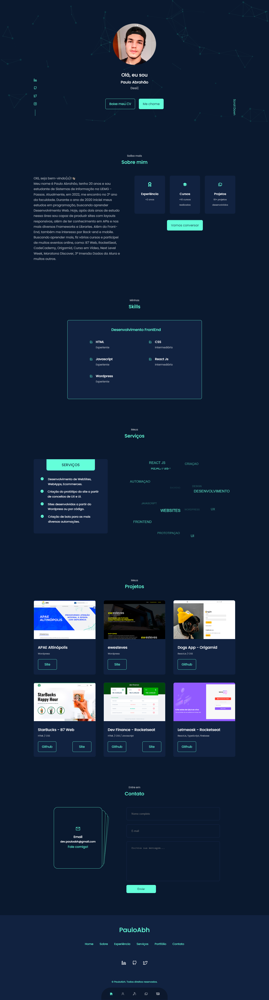

# Paulo Abrahão

  

## 💻 Projeto desenvolvido utilizando:
- React Js
- Sass
- react-tsparticles
- typewriter-effect
- emailjs
- swiperjs

## 🔖 Layout

Você pode visualizar o projeto através do link abaixo:

- <a target="_blank" href="pauloabh.netlify.app"> pauloabh.netlify.app </a>

#### Projeto desenvolvido para fim de estudos, visando melhorar meu código em ReactJs, Sass e aproveitando para explorar pacotes npm.
